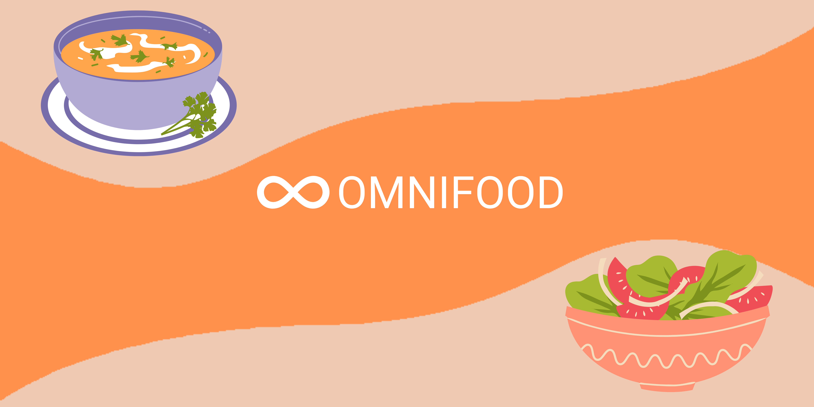

<h1 align="center">
  
</h1>

<h1>OMNIFOOD</h1>

## Descrição do Projeto

OMNIFOOD page from <a href="https://www.udemy.com/course/design-and-develop-a-killer-website-with-html5-and-css3/">Build Responsive Real-World Websites with HTML and CSS
</a> 
  

  
  

 <a href="#objectives">objectives</a> •
 <a href="#techs">Techs</a> • 
 <a href="#licenc-a">Licença</a> • 
 <a href="#autor">Autor</a>
  

<h4 align="center"> 
✔ OMNIFOOD 🥗 COMPLETED ✔
</h4>

### objectives
Build a full responsive Website with HTML CSS and some JavaScript
### Features

- [x] Responsive layout

### Techs

The technologies used on this project are the following:

- [Visual Studio Code](https://code.visualstudio.com/download)
- [HTML](https://developer.mozilla.org/en-US/docs/Glossary/HTML5)
- [CSS3](https://developer.mozilla.org/en-US/docs/Web/CSS)
- [JavaScript](https://www.javascript.com/)
